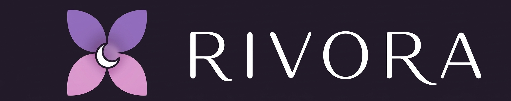

# RIVORA — Complete Spec Driven Development (SDD)
# Landing Website Specification

**Version**: 1.0  
**Date**: 2026-05-15  
**App**: Rivora — Women's Health & Cycle Tracking App  
**Market**: Pakistan + India, Gen Z (18–30)  
**Website Goal**: Equal split — brand awareness + waitlist collection  
**Waitlist URL**: https://forms.gle/pjGBnTUd3Xd73Sjw8  
**Footer Credit**: © 2026 Rivora Team  
**Status**: Coming Soon  

---

## PART 1 — DESIGN RATIONALE
### Principles Applied

#### HCI (Human-Computer Interaction)
- **Progressive Disclosure**: One idea per viewport. Each scroll section reveals exactly one concept. No section competes with another for attention.
- **Cognitive Load**: Max 3 information units per section (headline + subtext + CTA or visual). Never more.
- **CTA Hierarchy**: One primary CTA (Join Waitlist) repeated 3 times in the page — Hero, mid-page, and final section. Secondary CTAs are visually subordinate.
- **Gestalt Proximity**: Related items grouped in cards. Phase cards use consistent visual grammar so the pattern is learned once, applied four times.
- **Error Prevention in Navigation**: Sticky nav always gives user an escape/action. Never more than 2 nav items to reduce decision paralysis.
- **Familiarity**: Bottom-tab-style visual language mirrors the app itself so users subconsciously preview the product.

#### Human Psychology
- **Narrative Arc (Story Spine)**: Problem → Empathy → Revelation → Solution → Trust → Action. Humans process stories 22x more memorably than facts.
- **Loss Aversion framing** for the problem section: frame what couples LOSE by not understanding cycles, not what they gain. More emotionally activating.
- **Empathy before features**: Users must feel understood BEFORE they see product benefits. Showing features first = cognitive rejection.
- **Color Psychology**:
  - Deep dark background (#0a0812) = intimacy, privacy, safety. Like opening an app at night. Signals discretion.
  - Purple = trust, femininity, wisdom, spirituality. Dominant brand color.
  - Coral/Rose = warmth, connection, love. Used for relationship/partner sections.
  - Gold = energy, optimism, health. Used for phase/growth sections.
  - Deep Blue = calm, introspection. Used for reflection/privacy sections.
- **Social Proof timing**: Introduced AFTER emotional engagement, not before. Trust signals land better after the user already cares.
- **Autonomy & Privacy framing**: Lead with "your data is yours" not "we protect your data." Active framing gives the user agency.
- **Scarcity / anticipation**: "Coming Soon" + waitlist creates FOMO without being aggressive.

#### Computer Graphics
- **Dark theme as default**: Deep space dark background creates a premium, cinematic feel. Aligns with Gen Z preference and Rivora's app default.
- **Atmospheric depth**: Radial gradient orbs (purple/coral) float in the background. They create depth without clutter. No sharp shapes.
- **Scroll-parallax**: Hero background layers move at 0.4x scroll speed. Creates 3D depth sensation.
- **Phase color transitions**: As user scrolls through cycle phase cards, the ambient background hue subtly shifts to match each phase color. Immersive.
- **Staggered animation**: Each child element in a section fades-in-up with a 120ms stagger. Creates a cascade effect that feels alive.
- **Typography contrast**: Cormorant Garamond (serif, editorial, feminine, literary) for headlines. DM Sans (geometric, clean, modern) for body. This pairing signals "premium but approachable."
- **Negative space as design**: Large whitespace between sections is intentional. Breathing room increases perceived premium quality.

---

## PART 2 — TECHNICAL SPECIFICATION

### Stack
- **Single HTML file** — `index.html`
- Pure HTML5 + CSS3 + Vanilla JavaScript. Zero frameworks. Zero build tools.
- **Google Fonts CDN**: Cormorant Garamond + DM Sans
- **No external JS libraries**
- **IntersectionObserver API** for scroll-triggered animations
- **CSS Custom Properties** for all colors and spacing
- **Mobile-first responsive**: 360px → 768px → 1024px → 1440px

### File Structure
```
rivora-website/
├── index.html          ← entire website (single file)
├── logo.png            ← Rivora logo (jasmine flower + wordmark)
└── RIVORA_SDD_SPEC.md  ← this file
```

### Performance Requirements
- First Contentful Paint < 1.5s
- No render-blocking resources except Google Fonts
- All animations use `transform` and `opacity` only (GPU composited, no layout reflow)
- `will-change: transform` on parallax elements
- `prefers-reduced-motion` media query disables all animations for accessibility

### Browser Support
- Chrome 90+, Safari 14+, Firefox 88+, Edge 90+
- Android WebView (for Pakistani/Indian Android users)

---

## PART 3 — CSS DESIGN SYSTEM

### Color Tokens (CSS Custom Properties)
```css
:root {
  /* Brand */
  --color-primary: #9b7dba;
  --color-primary-dark: #6b4f8a;
  --color-primary-light: #c4a8e0;
  --color-primary-glow: rgba(155, 125, 186, 0.18);

  /* Cycle Phase Colors */
  --color-phase-reset: #8b3a3a;       /* Menstruation — deep red */
  --color-phase-energy: #c9a961;      /* Follicular — warm gold */
  --color-phase-peak: #e08090;        /* Ovulation — coral pink */
  --color-phase-reflect: #4a5a8a;     /* Luteal — deep blue */

  /* Phase Glows (for card backgrounds) */
  --glow-reset: rgba(139, 58, 58, 0.12);
  --glow-energy: rgba(201, 169, 97, 0.12);
  --glow-peak: rgba(224, 128, 144, 0.12);
  --glow-reflect: rgba(74, 90, 138, 0.12);

  /* Backgrounds */
  --bg-primary: #0a0812;
  --bg-secondary: #0f0d1a;
  --bg-tertiary: #130f20;
  --bg-card: rgba(255, 255, 255, 0.03);
  --bg-card-hover: rgba(155, 125, 186, 0.06);

  /* Text */
  --text-primary: #f0eaf8;
  --text-secondary: #a899c0;
  --text-muted: #6b5f80;
  --text-on-purple: #ffffff;

  /* Borders */
  --border-subtle: rgba(155, 125, 186, 0.12);
  --border-medium: rgba(155, 125, 186, 0.25);
  --border-strong: rgba(155, 125, 186, 0.45);

  /* Spacing Scale (8pt grid) */
  --space-1: 8px;
  --space-2: 16px;
  --space-3: 24px;
  --space-4: 32px;
  --space-5: 48px;
  --space-6: 64px;
  --space-7: 96px;
  --space-8: 128px;

  /* Typography Scale */
  --font-display: 'Cormorant Garamond', Georgia, serif;
  --font-body: 'DM Sans', system-ui, -apple-system, sans-serif;

  /* Border Radius */
  --radius-sm: 8px;
  --radius-md: 16px;
  --radius-lg: 24px;
  --radius-xl: 40px;
  --radius-full: 9999px;
}
```

### Typography Rules
```
Display / Hero H1:
  font-family: var(--font-display)
  font-weight: 300 (light — elegant, not heavy)
  font-size: clamp(48px, 7vw, 100px)
  line-height: 1.05
  letter-spacing: -0.02em
  color: var(--text-primary)

Section H2:
  font-family: var(--font-display)
  font-weight: 400
  font-size: clamp(36px, 5vw, 72px)
  line-height: 1.1
  letter-spacing: -0.01em

Card H3:
  font-family: var(--font-display)
  font-weight: 400
  font-size: clamp(22px, 3vw, 32px)
  line-height: 1.2

Body Large:
  font-family: var(--font-body)
  font-weight: 300
  font-size: clamp(16px, 1.5vw, 20px)
  line-height: 1.75
  color: var(--text-secondary)

Body Regular:
  font-family: var(--font-body)
  font-weight: 400
  font-size: 16px
  line-height: 1.7

Label / Caption:
  font-family: var(--font-body)
  font-weight: 500
  font-size: 13px
  letter-spacing: 0.12em
  text-transform: uppercase
  color: var(--text-muted)
```

### Animation System
```css
/* Base reveal state — all .reveal elements start here */
.reveal {
  opacity: 0;
  transform: translateY(36px);
  transition: opacity 0.9s cubic-bezier(0.16, 1, 0.3, 1),
              transform 0.9s cubic-bezier(0.16, 1, 0.3, 1);
}

/* When IntersectionObserver adds .visible class */
.reveal.visible {
  opacity: 1;
  transform: translateY(0);
}

/* Stagger delays for child elements */
.reveal:nth-child(1) { transition-delay: 0ms; }
.reveal:nth-child(2) { transition-delay: 120ms; }
.reveal:nth-child(3) { transition-delay: 240ms; }
.reveal:nth-child(4) { transition-delay: 360ms; }

/* Fade only (no vertical movement) variant */
.reveal-fade {
  opacity: 0;
  transition: opacity 1.2s ease;
}
.reveal-fade.visible { opacity: 1; }

/* Scale reveal for cards */
.reveal-scale {
  opacity: 0;
  transform: scale(0.95) translateY(20px);
  transition: opacity 0.8s cubic-bezier(0.16, 1, 0.3, 1),
              transform 0.8s cubic-bezier(0.16, 1, 0.3, 1);
}
.reveal-scale.visible {
  opacity: 1;
  transform: scale(1) translateY(0);
}

/* CTA pulse animation */
@keyframes pulse-glow {
  0%, 100% { box-shadow: 0 0 0 0 rgba(155, 125, 186, 0); }
  50%       { box-shadow: 0 0 32px 8px rgba(155, 125, 186, 0.25); }
}

/* Floating orb drift */
@keyframes orb-drift {
  0%, 100% { transform: translate(0, 0) scale(1); }
  33%       { transform: translate(30px, -20px) scale(1.05); }
  66%       { transform: translate(-20px, 15px) scale(0.97); }
}

/* prefers-reduced-motion: kill all animations */
@media (prefers-reduced-motion: reduce) {
  .reveal, .reveal-fade, .reveal-scale { transition: none; opacity: 1; transform: none; }
  * { animation: none !important; }
}
```

---

## PART 4 — SECTION-BY-SECTION SPECIFICATION

---

### SECTION 0 — NAVIGATION (Sticky)

**Purpose**: Always-present anchor. Gives user orientation and constant access to primary CTA.

**Psychology**: Sticky nav reduces anxiety ("I can always get back"). Single action button reduces decision paralysis.

**HTML Structure**:
```html
<nav id="main-nav">
  <div class="nav-inner">
    <a href="#" class="nav-logo" aria-label="Rivora home">
      
    </a>
    <a href="https://forms.gle/pjGBnTUd3Xd73Sjw8"
       target="_blank"
       rel="noopener"
       class="btn-nav"
       aria-label="Join Rivora waitlist">
      Join Waitlist
    </a>
  </div>
</nav>
```

**CSS Rules**:
```
position: fixed
top: 0, left: 0, right: 0
z-index: 1000
height: 72px
padding: 0 clamp(24px, 5vw, 80px)

Initial state:
  background: transparent
  border-bottom: 1px solid transparent
  backdrop-filter: none

Scrolled state (JS adds .scrolled class when scrollY > 60):
  background: rgba(10, 8, 18, 0.85)
  backdrop-filter: blur(20px) saturate(180%)
  border-bottom: 1px solid var(--border-subtle)
  transition: all 0.4s ease

.nav-inner:
  display: flex
  align-items: center
  justify-content: space-between
  max-width: 1280px
  margin: 0 auto
  height: 100%

.btn-nav:
  font-family: var(--font-body)
  font-size: 14px
  font-weight: 500
  color: var(--text-primary)
  background: var(--bg-card)
  border: 1px solid var(--border-medium)
  border-radius: var(--radius-full)
  padding: 10px 24px
  text-decoration: none
  transition: background 0.3s, border-color 0.3s

.btn-nav:hover:
  background: var(--color-primary-glow)
  border-color: var(--border-strong)
```

**JavaScript**:
```javascript
window.addEventListener('scroll', () => {
  const nav = document.getElementById('main-nav');
  nav.classList.toggle('scrolled', window.scrollY > 60);
});
```

---

### SECTION 1 — HERO

**Purpose**: Hook the user emotionally in the first 3 seconds. Establish the emotional premise. One primary CTA.

**Psychology**: The headline uses an unexpected, poetic statement that creates cognitive dissonance ("some arguments aren't arguments?"). This forces the reader to pause and read more. This is the "pattern interrupt" technique used in award-winning copywriting.

**Narrative**: Opens the story. Sets the emotional stakes.

**HTML Structure**:
```html
<section id="hero" aria-label="Hero">

  <!-- Atmospheric background orbs (decorative, aria-hidden) -->
  <div class="hero-bg" aria-hidden="true">
    <div class="orb orb-1"></div>  <!-- large purple orb, top-right -->
    <div class="orb orb-2"></div>  <!-- medium coral orb, bottom-left -->
    <div class="orb orb-3"></div>  <!-- small gold orb, center-right -->
  </div>

  <!-- Parallax wrapper (JS moves this at 0.4x scroll rate) -->
  <div class="hero-parallax" id="hero-parallax">

    <!-- Coming Soon badge -->
    <div class="hero-badge reveal">
      <span class="badge-dot" aria-hidden="true"></span>
      Coming Soon
    </div>

    <!-- Main headline — split into two lines for visual rhythm -->
    <h1 class="hero-headline reveal">
      Some arguments<br>
      <em>aren't arguments.</em>
    </h1>

    <!-- Sub-headline -->
    <p class="hero-sub reveal">
      They're just misunderstood cycles.
    </p>

    <!-- Body description -->
    <p class="hero-body reveal">
      Rivora helps women understand their bodies —<br>
      and the people they love, understand them.
    </p>

    <!-- CTA group -->
    <div class="hero-cta-group reveal">
      <a href="https://forms.gle/pjGBnTUd3Xd73Sjw8"
         target="_blank"
         rel="noopener"
         class="btn-primary"
         aria-label="Join the Rivora waitlist">
        Join the Waitlist
      </a>
      <span class="hero-cta-sub">Free · Android · Launching Soon</span>
    </div>

    <!-- Scroll indicator -->
    <div class="scroll-indicator reveal" aria-hidden="true">
      <div class="scroll-line"></div>
      <span>Scroll</span>
    </div>

  </div>
</section>
```

**CSS Rules**:
```
#hero:
  min-height: 100vh
  display: flex
  align-items: center
  justify-content: center
  position: relative
  overflow: hidden
  padding: 120px clamp(24px, 8vw, 120px) 80px
  text-align: center

.hero-bg:
  position: absolute
  inset: 0
  pointer-events: none

.orb:
  position: absolute
  border-radius: 50%
  filter: blur(80px)
  animation: orb-drift 12s ease-in-out infinite

.orb-1:
  width: 600px, height: 600px
  top: -200px, right: -100px
  background: rgba(155, 125, 186, 0.2)
  animation-delay: 0s

.orb-2:
  width: 400px, height: 400px
  bottom: -100px, left: -100px
  background: rgba(224, 128, 144, 0.15)
  animation-delay: -4s

.orb-3:
  width: 300px, height: 300px
  top: 40%, right: 15%
  background: rgba(201, 169, 97, 0.1)
  animation-delay: -8s

.hero-parallax:
  position: relative
  z-index: 2
  max-width: 900px
  margin: 0 auto
  will-change: transform

.hero-badge:
  display: inline-flex
  align-items: center
  gap: 8px
  font-family: var(--font-body)
  font-size: 13px
  font-weight: 500
  letter-spacing: 0.1em
  text-transform: uppercase
  color: var(--color-primary-light)
  background: rgba(155, 125, 186, 0.08)
  border: 1px solid var(--border-medium)
  border-radius: var(--radius-full)
  padding: 8px 20px
  margin-bottom: 40px

.badge-dot:
  width: 8px, height: 8px
  border-radius: 50%
  background: var(--color-primary)
  animation: pulse-glow 2s ease-in-out infinite

.hero-headline:
  font-family: var(--font-display)
  font-weight: 300
  font-size: clamp(52px, 8vw, 108px)
  line-height: 1.0
  letter-spacing: -0.03em
  color: var(--text-primary)
  margin-bottom: 28px

.hero-headline em:
  font-style: italic
  color: var(--color-primary-light)

.hero-sub:
  font-family: var(--font-display)
  font-weight: 300
  font-style: italic
  font-size: clamp(22px, 3vw, 36px)
  color: var(--text-secondary)
  margin-bottom: 32px

.hero-body:
  font-family: var(--font-body)
  font-weight: 300
  font-size: clamp(16px, 1.8vw, 20px)
  color: var(--text-secondary)
  line-height: 1.8
  margin-bottom: 56px
  max-width: 600px
  margin-left: auto
  margin-right: auto

.hero-cta-group:
  display: flex
  flex-direction: column
  align-items: center
  gap: 16px

.btn-primary:
  display: inline-block
  font-family: var(--font-body)
  font-size: 16px
  font-weight: 500
  color: var(--text-on-purple)
  background: var(--color-primary)
  border: none
  border-radius: var(--radius-full)
  padding: 18px 48px
  text-decoration: none
  cursor: pointer
  animation: pulse-glow 3s ease-in-out infinite
  transition: background 0.3s, transform 0.2s

.btn-primary:hover:
  background: var(--color-primary-dark)
  transform: translateY(-2px)

.hero-cta-sub:
  font-family: var(--font-body)
  font-size: 13px
  color: var(--text-muted)
  letter-spacing: 0.05em

.scroll-indicator:
  position: absolute
  bottom: 40px
  left: 50%
  transform: translateX(-50%)
  display: flex
  flex-direction: column
  align-items: center
  gap: 8px
  font-size: 11px
  letter-spacing: 0.15em
  text-transform: uppercase
  color: var(--text-muted)

.scroll-line:
  width: 1px, height: 48px
  background: linear-gradient(to bottom, var(--border-medium), transparent)
  animation: scroll-line 2s ease-in-out infinite

@keyframes scroll-line:
  0% { transform: scaleY(0); transform-origin: top; }
  50% { transform: scaleY(1); transform-origin: top; }
  51% { transform: scaleY(1); transform-origin: bottom; }
  100% { transform: scaleY(0); transform-origin: bottom; }
```

**JavaScript**:
```javascript
// Hero parallax on scroll
const heroParallax = document.getElementById('hero-parallax');
window.addEventListener('scroll', () => {
  if (window.scrollY < window.innerHeight) {
    heroParallax.style.transform = `translateY(${window.scrollY * 0.4}px)`;
  }
}, { passive: true });
```

---

### SECTION 2 — THE PROBLEM (The Gap)

**Purpose**: Create deep empathy. Validate the user's pain before pitching anything. This is the emotional core.

**Psychology**: Loss aversion framing. "What couples lose" is more motivating than "what you gain." The 3 stat callouts use a "myth vs reality" structure to create cognitive dissonance and curiosity.

**Narrative**: "He thinks it's personal. It's not." — This line directly speaks to the male partner's experience while making female users feel understood.

**HTML Structure**:
```html
<section id="problem" aria-label="The problem Rivora solves">
  <div class="section-inner">

    <!-- Section label -->
    <p class="section-label reveal">The Gap</p>

    <!-- Two-column layout -->
    <div class="problem-grid">

      <!-- Left: emotional copy -->
      <div class="problem-copy">
        <h2 class="reveal">
          He thinks it's personal.<br>
          <em>It's not.</em>
        </h2>
        <p class="body-large reveal">
          Every month, the same confusion plays out. 
          She's exhausted and distant. He's hurt and silent.
          Neither of them knows why.
        </p>
        <p class="body-large reveal">
          It's not a relationship problem. It's a knowledge problem.
          The 28-day cycle creates predictable, real shifts in energy,
          mood, and needs — but no one ever taught him that.
        </p>
        <p class="body-large reveal">
          Rivora closes that gap.
        </p>
      </div>

      <!-- Right: animated cycle visual -->
      <div class="problem-visual reveal-fade" aria-hidden="true">
        <!-- SVG cycle ring — see SVG spec below -->
        <svg class="cycle-ring" viewBox="0 0 320 320" xmlns="http://www.w3.org/2000/svg">
          <!-- Outer ring track -->
          <circle cx="160" cy="160" r="130" fill="none"
                  stroke="rgba(155,125,186,0.1)" stroke-width="24"/>

          <!-- Phase arcs (stroke-dasharray/dashoffset technique) -->
          <!-- Phase 1: Menstruation — 25% of circle = 204 of 817 -->
          <circle cx="160" cy="160" r="130"
                  fill="none" stroke="#8b3a3a" stroke-width="24"
                  stroke-dasharray="204 613"
                  stroke-dashoffset="204"
                  stroke-linecap="round"
                  class="phase-arc" />

          <!-- Phase 2: Follicular — 25% -->
          <circle cx="160" cy="160" r="130"
                  fill="none" stroke="#c9a961" stroke-width="24"
                  stroke-dasharray="204 613"
                  stroke-dashoffset="0"
                  stroke-linecap="round"
                  class="phase-arc" />

          <!-- Phase 3: Ovulation — 25% -->
          <circle cx="160" cy="160" r="130"
                  fill="none" stroke="#e08090" stroke-width="24"
                  stroke-dasharray="204 613"
                  stroke-dashoffset="-204"
                  stroke-linecap="round"
                  class="phase-arc" />

          <!-- Phase 4: Luteal — 25% -->
          <circle cx="160" cy="160" r="130"
                  fill="none" stroke="#4a5a8a" stroke-width="24"
                  stroke-dasharray="204 613"
                  stroke-dashoffset="-408"
                  stroke-linecap="round"
                  class="phase-arc" />

          <!-- Center text -->
          <text x="160" y="148" text-anchor="middle"
                font-family="Cormorant Garamond, serif"
                font-size="18" fill="#a899c0" font-weight="300">
            28 days.
          </text>
          <text x="160" y="172" text-anchor="middle"
                font-family="Cormorant Garamond, serif"
                font-size="13" fill="#6b5f80" font-weight="300">
            4 phases.
          </text>
          <text x="160" y="193" text-anchor="middle"
                font-family="Cormorant Garamond, serif"
                font-size="13" fill="#6b5f80" font-weight="300">
            Infinite misunderstandings.
          </text>
        </svg>

        <!-- Phase labels around ring -->
        <div class="ring-labels">
          <span class="ring-label" style="color:#8b3a3a; top:10%; left:50%; transform:translateX(-50%)">Reset</span>
          <span class="ring-label" style="color:#c9a961; top:50%; right:2%">Growing Energy</span>
          <span class="ring-label" style="color:#e08090; bottom:10%; left:50%; transform:translateX(-50%)">Peak Energy</span>
          <span class="ring-label" style="color:#4a5a8a; top:50%; left:2%">Reflection</span>
        </div>
      </div>

    </div>

    <!-- 3 stat callouts -->
    <div class="stat-grid">
      <div class="stat-card reveal-scale">
        <span class="stat-number">28</span>
        <span class="stat-label">Day cycle.<br>Zero confusion, finally.</span>
      </div>
      <div class="stat-card reveal-scale">
        <span class="stat-number">4</span>
        <span class="stat-label">Phases. Each with<br>different needs.</span>
      </div>
      <div class="stat-card reveal-scale">
        <span class="stat-number">0</span>
        <span class="stat-label">Apps built<br>for both of you. Until now.</span>
      </div>
    </div>

  </div>
</section>
```

**CSS Rules**:
```
#problem:
  padding: var(--space-8) clamp(24px, 8vw, 120px)
  background: var(--bg-secondary)

.problem-grid:
  display: grid
  grid-template-columns: 1fr 1fr
  gap: var(--space-6)
  align-items: center
  margin: var(--space-5) 0 var(--space-7)

  @media (max-width: 768px):
    grid-template-columns: 1fr
    gap: var(--space-5)

.problem-copy h2:
  font-size: clamp(36px, 4.5vw, 64px)
  margin-bottom: var(--space-4)
  em: color var(--color-primary-light), font-style italic

.problem-visual:
  position: relative
  display: flex
  align-items: center
  justify-content: center
  height: 360px

.cycle-ring:
  width: 320px, height: 320px
  filter: drop-shadow(0 0 40px rgba(155,125,186,0.15))

.ring-labels:
  position: absolute
  inset: 0
  pointer-events: none

.ring-label:
  position: absolute
  font-family: var(--font-body)
  font-size: 12px
  font-weight: 500
  letter-spacing: 0.08em
  text-transform: uppercase

.stat-grid:
  display: grid
  grid-template-columns: repeat(3, 1fr)
  gap: var(--space-3)

  @media (max-width: 600px):
    grid-template-columns: 1fr

.stat-card:
  background: var(--bg-card)
  border: 1px solid var(--border-subtle)
  border-radius: var(--radius-lg)
  padding: var(--space-4)
  text-align: center

.stat-number:
  display: block
  font-family: var(--font-display)
  font-size: 72px
  font-weight: 300
  line-height: 1
  color: var(--color-primary)
  margin-bottom: var(--space-2)

.stat-label:
  font-family: var(--font-body)
  font-size: 14px
  font-weight: 300
  color: var(--text-secondary)
  line-height: 1.6
```

---

### SECTION 3 — THE CYCLE (Revelation)

**Purpose**: Educate the user on the 4 phases with empowering names. The "aha moment" section. This is where the product's core value becomes tangible.

**Psychology**: Naming the phases with empowering, non-clinical language ("Growing Energy" vs "Follicular") reduces stigma and increases relatability. Sequential card reveal creates anticipation.

**HTML Structure**:
```html
<section id="the-cycle" aria-label="The four cycle phases">
  <div class="section-inner">

    <p class="section-label reveal">Her Rhythm</p>
    <h2 class="reveal">
      Her body has a rhythm.<br>
      <em>Now you can both hear it.</em>
    </h2>
    <p class="body-large reveal" style="max-width:600px; margin:0 auto var(--space-6)">
      Every 28 days, four distinct phases shape her energy, mood, 
      and needs. Understanding this changes everything.
    </p>

    <!-- Phase cards grid -->
    <div class="phase-grid">

      <!-- Phase 1: Reset Week -->
      <div class="phase-card reveal-scale" data-phase="reset"
           style="--phase-color: #8b3a3a; --phase-glow: rgba(139,58,58,0.1)">
        <div class="phase-card-inner">
          <div class="phase-icon" aria-hidden="true">🔴</div>
          <div class="phase-tag">Week 1</div>
          <h3>Reset Week</h3>
          <p class="phase-body">Her body is renewing. She needs rest, warmth, and space. Small gestures mean everything right now.</p>
          <div class="phase-tags">
            <span>Rest</span>
            <span>Comfort</span>
            <span>Space</span>
          </div>
        </div>
      </div>

      <!-- Phase 2: Growing Energy -->
      <div class="phase-card reveal-scale" data-phase="energy"
           style="--phase-color: #c9a961; --phase-glow: rgba(201,169,97,0.1)">
        <div class="phase-card-inner">
          <div class="phase-icon" aria-hidden="true">🟡</div>
          <div class="phase-tag">Week 2</div>
          <h3>Growing Energy</h3>
          <p class="phase-body">Her energy rises. She's curious, social, and open to adventure. The best time for plans and new experiences.</p>
          <div class="phase-tags">
            <span>Adventurous</span>
            <span>Social</span>
            <span>Optimistic</span>
          </div>
        </div>
      </div>

      <!-- Phase 3: Peak Energy -->
      <div class="phase-card reveal-scale" data-phase="peak"
           style="--phase-color: #e08090; --phase-glow: rgba(224,128,144,0.1)">
        <div class="phase-card-inner">
          <div class="phase-icon" aria-hidden="true">🌸</div>
          <div class="phase-tag">Week 3</div>
          <h3>Peak Energy</h3>
          <p class="phase-body">Her highest confidence. She feels magnetic and alive. Make this week memorable — she will always remember.</p>
          <div class="phase-tags">
            <span>Confident</span>
            <span>Radiant</span>
            <span>Expressive</span>
          </div>
        </div>
      </div>

      <!-- Phase 4: Reflection -->
      <div class="phase-card reveal-scale" data-phase="reflect"
           style="--phase-color: #4a5a8a; --phase-glow: rgba(74,90,138,0.1)">
        <div class="phase-card-inner">
          <div class="phase-icon" aria-hidden="true">🔵</div>
          <div class="phase-tag">Week 4</div>
          <h3>Reflection Week</h3>
          <p class="phase-body">Her energy turns inward. She's introspective and sensitive. Patience and calm presence is the greatest gift.</p>
          <div class="phase-tags">
            <span>Introspective</span>
            <span>Sensitive</span>
            <span>Calm</span>
          </div>
        </div>
      </div>

    </div>
  </div>
</section>
```

**CSS Rules**:
```
#the-cycle:
  padding: var(--space-8) clamp(24px, 8vw, 120px)
  background: var(--bg-primary)
  text-align: center

.phase-grid:
  display: grid
  grid-template-columns: repeat(4, 1fr)
  gap: var(--space-3)
  margin-top: var(--space-5)

  @media (max-width: 1024px): grid-template-columns: repeat(2, 1fr)
  @media (max-width: 560px): grid-template-columns: 1fr

.phase-card:
  background: var(--phase-glow, var(--bg-card))
  border: 1px solid rgba(var(--phase-color-rgb, 155, 125, 186), 0.2)
  border-top: 2px solid var(--phase-color)
  border-radius: var(--radius-lg)
  overflow: hidden
  transition: transform 0.3s ease, box-shadow 0.3s ease
  cursor: default
  text-align: left

.phase-card:hover:
  transform: translateY(-6px)
  box-shadow: 0 24px 48px rgba(0,0,0,0.3)

.phase-card-inner:
  padding: var(--space-4)

.phase-icon:
  font-size: 28px
  margin-bottom: var(--space-2)
  display: block

.phase-tag:
  font-family: var(--font-body)
  font-size: 11px
  font-weight: 500
  letter-spacing: 0.12em
  text-transform: uppercase
  color: var(--phase-color)
  margin-bottom: var(--space-2)

.phase-card h3:
  font-family: var(--font-display)
  font-size: 26px
  font-weight: 400
  color: var(--text-primary)
  margin-bottom: var(--space-2)
  line-height: 1.2

.phase-body:
  font-family: var(--font-body)
  font-size: 14px
  font-weight: 300
  color: var(--text-secondary)
  line-height: 1.7
  margin-bottom: var(--space-3)

.phase-tags:
  display: flex
  flex-wrap: wrap
  gap: 6px

.phase-tags span:
  font-family: var(--font-body)
  font-size: 11px
  font-weight: 500
  color: var(--phase-color)
  background: rgba(0,0,0,0.2)
  border: 1px solid var(--phase-color)
  border-radius: var(--radius-full)
  padding: 4px 12px
  opacity: 0.85
```

---

### SECTION 4 — DUAL VALUE (For Her. For Him.)

**Purpose**: Show both users that Rivora is built for them. The "bridge" moment.

**Psychology**: Split-screen creates visual metaphor of "two worlds connected." Neither side feels secondary. The center logo as a bridge reinforces the connection metaphor. This is the brand's unique dual-user promise made visual.

**HTML Structure**:
```html
<section id="dual-value" aria-label="Rivora for her and for him">
  <div class="section-inner">

    <p class="section-label reveal">Two Sides. One App.</p>
    <h2 class="reveal">
      Built for her.<br>
      <em>Designed to help him.</em>
    </h2>

    <div class="dual-grid">

      <!-- Her side -->
      <div class="dual-card dual-her reveal-scale">
        <p class="dual-label" style="color: var(--color-primary-light)">For Her</p>
        <h3>Understand<br>your body.</h3>
        <ul class="dual-list">
          <li>
            <span class="dual-check" style="color:var(--color-primary)">✓</span>
            Track your cycle with precision
          </li>
          <li>
            <span class="dual-check" style="color:var(--color-primary)">✓</span>
            Phase-specific nutrition & health tips
          </li>
          <li>
            <span class="dual-check" style="color:var(--color-primary)">✓</span>
            Mood & energy logging
          </li>
          <li>
            <span class="dual-check" style="color:var(--color-primary)">✓</span>
            Complete privacy — app lock built in
          </li>
          <li>
            <span class="dual-check" style="color:var(--color-primary)">✓</span>
            You control every detail
          </li>
        </ul>
      </div>

      <!-- Center divider with logo -->
      <div class="dual-center reveal-fade" aria-hidden="true">
        <div class="dual-center-line top"></div>
        <div class="dual-logo-wrap">
          
        </div>
        <div class="dual-center-line bottom"></div>
      </div>

      <!-- Him side -->
      <div class="dual-card dual-him reveal-scale">
        <p class="dual-label" style="color: #8ab4d4">For Him</p>
        <h3>Support her.<br>Stop guessing.</h3>
        <ul class="dual-list">
          <li>
            <span class="dual-check" style="color:#4a5a8a">✓</span>
            Know her current phase
          </li>
          <li>
            <span class="dual-check" style="color:#4a5a8a">✓</span>
            Get "what to do this week" suggestions
          </li>
          <li>
            <span class="dual-check" style="color:#4a5a8a">✓</span>
            Context-aware date ideas
          </li>
          <li>
            <span class="dual-check" style="color:#4a5a8a">✓</span>
            Never misread her mood again
          </li>
          <li>
            <span class="dual-check" style="color:#4a5a8a">✓</span>
            Become the partner she needs
          </li>
        </ul>
      </div>

    </div>
  </div>
</section>
```

**CSS Rules**:
```
#dual-value:
  padding: var(--space-8) clamp(24px, 8vw, 120px)
  background: var(--bg-tertiary)
  text-align: center

.dual-grid:
  display: grid
  grid-template-columns: 1fr auto 1fr
  gap: 0
  align-items: stretch
  margin-top: var(--space-6)
  max-width: 900px
  margin-left: auto
  margin-right: auto

  @media (max-width: 768px):
    grid-template-columns: 1fr
    gap: var(--space-4)
    .dual-center: display none

.dual-card:
  background: var(--bg-card)
  border: 1px solid var(--border-subtle)
  border-radius: var(--radius-lg)
  padding: var(--space-5)
  text-align: left

.dual-her:
  border-color: rgba(155, 125, 186, 0.2)
  border-right: none
  border-radius: var(--radius-lg) 0 0 var(--radius-lg)

  @media (max-width: 768px):
    border-right: 1px solid var(--border-subtle)
    border-radius: var(--radius-lg)

.dual-him:
  border-color: rgba(74, 90, 138, 0.2)
  border-left: none
  border-radius: 0 var(--radius-lg) var(--radius-lg) 0

  @media (max-width: 768px):
    border-left: 1px solid var(--border-subtle)
    border-radius: var(--radius-lg)

.dual-label:
  font-family: var(--font-body)
  font-size: 12px
  font-weight: 500
  letter-spacing: 0.12em
  text-transform: uppercase
  margin-bottom: var(--space-2)

.dual-card h3:
  font-family: var(--font-display)
  font-size: 32px
  font-weight: 400
  color: var(--text-primary)
  line-height: 1.1
  margin-bottom: var(--space-4)

.dual-list:
  list-style: none
  display: flex
  flex-direction: column
  gap: var(--space-2)

.dual-list li:
  font-family: var(--font-body)
  font-size: 15px
  font-weight: 300
  color: var(--text-secondary)
  display: flex
  align-items: baseline
  gap: 12px

.dual-check:
  font-size: 14px
  flex-shrink: 0

.dual-center:
  width: 64px
  display: flex
  flex-direction: column
  align-items: center
  justify-content: center
  gap: var(--space-3)

.dual-center-line:
  flex: 1
  width: 1px
  background: var(--border-subtle)

.dual-logo-wrap:
  width: 56px, height: 56px
  border-radius: 50%
  background: var(--bg-secondary)
  border: 1px solid var(--border-medium)
  display: flex
  align-items: center
  justify-content: center
```

---

### SECTION 5 — FEATURES

**Purpose**: Show three key pillars of the product. Features presented as user benefits, not technical specs.

**Psychology**: Rule of three (3 features) is cognitively optimal — easy to remember. Each feature uses a visual metaphor (icon + headline) before explanation. Icon first = less cognitive effort.

**HTML Structure**:
```html
<section id="features" aria-label="Rivora key features">
  <div class="section-inner">

    <p class="section-label reveal">What Rivora Does</p>
    <h2 class="reveal">Everything you need.<br><em>Nothing you don't.</em></h2>

    <div class="features-grid">

      <div class="feature-block reveal-scale">
        <div class="feature-icon-wrap" aria-hidden="true">
          <!-- SVG lock icon -->
          <svg width="32" height="32" viewBox="0 0 32 32" fill="none">
            <rect x="7" y="14" width="18" height="13" rx="3"
                  fill="none" stroke="#9b7dba" stroke-width="1.5"/>
            <path d="M11 14v-4a5 5 0 0 1 10 0v4"
                  stroke="#9b7dba" stroke-width="1.5"
                  stroke-linecap="round"/>
            <circle cx="16" cy="20" r="2" fill="#9b7dba"/>
          </svg>
        </div>
        <h3>Privacy First.<br>Always.</h3>
        <p>App lock, hidden notifications, and granular controls. On shared devices in South Asia, your privacy is not optional — it's built in from day one.</p>
      </div>

      <div class="feature-block reveal-scale">
        <div class="feature-icon-wrap" aria-hidden="true">
          <!-- SVG leaf/health icon -->
          <svg width="32" height="32" viewBox="0 0 32 32" fill="none">
            <path d="M16 4C16 4 6 9 6 18a10 10 0 0 0 20 0C26 9 16 4 16 4z"
                  fill="none" stroke="#c9a961" stroke-width="1.5"
                  stroke-linejoin="round"/>
            <path d="M16 28V16M16 16C16 16 11 12 8 10"
                  stroke="#c9a961" stroke-width="1.5"
                  stroke-linecap="round"/>
          </svg>
        </div>
        <h3>Health Tips<br>for Every Phase.</h3>
        <p>Iron this week. Magnesium next week. Rivora gives phase-specific nutrition guidance so her body gets what it actually needs — when it needs it.</p>
      </div>

      <div class="feature-block reveal-scale">
        <div class="feature-icon-wrap" aria-hidden="true">
          <!-- SVG heart/connection icon -->
          <svg width="32" height="32" viewBox="0 0 32 32" fill="none">
            <path d="M16 27S5 19.5 5 12.5a6.5 6.5 0 0 1 11-4.7A6.5 6.5 0 0 1 27 12.5C27 19.5 16 27 16 27z"
                  fill="none" stroke="#e08090" stroke-width="1.5"
                  stroke-linejoin="round"/>
          </svg>
        </div>
        <h3>Relationship<br>Intelligence.</h3>
        <p>He gets weekly context — what she needs, what helps, what doesn't. Not data. Actionable guidance that turns good intentions into real support.</p>
      </div>

    </div>
  </div>
</section>
```

**CSS Rules**:
```
#features:
  padding: var(--space-8) clamp(24px, 8vw, 120px)
  background: var(--bg-primary)
  text-align: center

.features-grid:
  display: grid
  grid-template-columns: repeat(3, 1fr)
  gap: var(--space-4)
  margin-top: var(--space-6)

  @media (max-width: 900px): grid-template-columns: 1fr
  @media (min-width: 600px) and (max-width: 900px): grid-template-columns: repeat(2, 1fr)

.feature-block:
  background: var(--bg-card)
  border: 1px solid var(--border-subtle)
  border-radius: var(--radius-lg)
  padding: var(--space-5)
  text-align: left
  transition: border-color 0.3s, background 0.3s

.feature-block:hover:
  border-color: var(--border-medium)
  background: var(--bg-card-hover)

.feature-icon-wrap:
  width: 56px, height: 56px
  background: rgba(155, 125, 186, 0.08)
  border: 1px solid var(--border-subtle)
  border-radius: var(--radius-md)
  display: flex
  align-items: center
  justify-content: center
  margin-bottom: var(--space-3)

.feature-block h3:
  font-family: var(--font-display)
  font-size: 28px
  font-weight: 400
  line-height: 1.15
  color: var(--text-primary)
  margin-bottom: var(--space-2)

.feature-block p:
  font-family: var(--font-body)
  font-size: 15px
  font-weight: 300
  color: var(--text-secondary)
  line-height: 1.75
```

---

### SECTION 6 — TRUST

**Purpose**: Address the unspoken objections — especially around privacy and cultural fit.

**Psychology**: By naming the cultural context ("South Asia"), Rivora signals deep understanding. This is "mirror the user" psychology — when a brand shows it knows your world, trust skyrockets. Three trust signals use the classic "rule of three" for memorability.

**HTML Structure**:
```html
<section id="trust" aria-label="Why trust Rivora">
  <div class="section-inner">

    <p class="section-label reveal">Built for You</p>
    <h2 class="reveal">
      Made in South Asia.<br>
      <em>For South Asia.</em>
    </h2>
    <p class="body-large reveal" style="max-width:580px; margin: 0 auto var(--space-6)">
      We understand shared devices. We understand family privacy. 
      We understand that health conversations can be complicated here.
      Rivora was designed with all of that in mind — from day one.
    </p>

    <!-- Trust pills -->
    <div class="trust-grid">
      <div class="trust-pill reveal">
        <svg width="20" height="20" viewBox="0 0 20 20" fill="none" aria-hidden="true">
          <path d="M10 2L3 5v5c0 4.4 3 8.3 7 9.3 4-1 7-4.9 7-9.3V5L10 2z"
                fill="none" stroke="#9b7dba" stroke-width="1.5"
                stroke-linejoin="round"/>
          <path d="M7 10l2 2 4-4" stroke="#9b7dba" stroke-width="1.5"
                stroke-linecap="round" stroke-linejoin="round"/>
        </svg>
        <span>End-to-end encrypted</span>
      </div>
      <div class="trust-pill reveal">
        <svg width="20" height="20" viewBox="0 0 20 20" fill="none" aria-hidden="true">
          <circle cx="10" cy="10" r="8" fill="none" stroke="#c9a961" stroke-width="1.5"/>
          <path d="M7 10l2 2 4-4" stroke="#c9a961" stroke-width="1.5"
                stroke-linecap="round" stroke-linejoin="round"/>
        </svg>
        <span>Zero ads. Ever.</span>
      </div>
      <div class="trust-pill reveal">
        <svg width="20" height="20" viewBox="0 0 20 20" fill="none" aria-hidden="true">
          <circle cx="10" cy="7" r="3" fill="none" stroke="#e08090" stroke-width="1.5"/>
          <path d="M3 17c0-3.3 3.1-6 7-6s7 2.7 7 6"
                fill="none" stroke="#e08090" stroke-width="1.5"
                stroke-linecap="round"/>
        </svg>
        <span>Your data. Your control.</span>
      </div>
    </div>

  </div>
</section>
```

**CSS Rules**:
```
#trust:
  padding: var(--space-8) clamp(24px, 8vw, 120px)
  background: var(--bg-secondary)
  text-align: center

.trust-grid:
  display: flex
  flex-wrap: wrap
  justify-content: center
  gap: var(--space-2)

.trust-pill:
  display: inline-flex
  align-items: center
  gap: 10px
  font-family: var(--font-body)
  font-size: 15px
  font-weight: 400
  color: var(--text-secondary)
  background: var(--bg-card)
  border: 1px solid var(--border-subtle)
  border-radius: var(--radius-full)
  padding: 14px 28px
  transition: border-color 0.3s

.trust-pill:hover:
  border-color: var(--border-medium)
```

---

### SECTION 7 — WAITLIST CTA (Final Call to Action)

**Purpose**: Convert. This is the emotional peak — everything has built to this moment.

**Psychology**: After the full narrative journey, users are primed. The headline shifts from "explaining" to "inviting." The framing "thousands on the waitlist" creates social proof + FOMO. The button is large, purple, centered — unmissable. "Be the first" triggers exclusivity psychology.

**HTML Structure**:
```html
<section id="waitlist" aria-label="Join the Rivora waitlist">

  <!-- Background atmospheric layer -->
  <div class="waitlist-bg" aria-hidden="true">
    <div class="waitlist-orb orb-left"></div>
    <div class="waitlist-orb orb-right"></div>
  </div>

  <div class="section-inner waitlist-inner">

    <!-- App logo centered -->
    <div class="waitlist-logo reveal">
      
    </div>

    <!-- Coming soon pill -->
    <div class="hero-badge reveal" style="margin-bottom: var(--space-4)">
      <span class="badge-dot"></span>
      Coming Soon · Android
    </div>

    <!-- Big headline -->
    <h2 class="waitlist-headline reveal">
      Be the first<br>
      <em>to understand.</em>
    </h2>

    <p class="waitlist-sub reveal">
      Rivora is launching soon. Join the waitlist and be among 
      the first to experience a relationship — and a body — 
      finally understood.
    </p>

    <!-- CTA Button -->
    <a href="https://forms.gle/pjGBnTUd3Xd73Sjw8"
       target="_blank"
       rel="noopener"
       class="btn-primary btn-large reveal"
       aria-label="Join Rivora waitlist on Google Forms">
      Join the Waitlist →
    </a>

    <p class="waitlist-note reveal">
      Free to join · No spam · Unsubscribe anytime
    </p>

  </div>
</section>
```

**CSS Rules**:
```
#waitlist:
  padding: var(--space-8) clamp(24px, 8vw, 120px)
  background: var(--bg-primary)
  position: relative
  overflow: hidden
  text-align: center

.waitlist-bg:
  position: absolute
  inset: 0
  pointer-events: none

.waitlist-orb:
  position: absolute
  border-radius: 50%
  filter: blur(100px)

.orb-left:
  width: 500px, height: 500px
  top: -100px, left: -200px
  background: rgba(155, 125, 186, 0.15)

.orb-right:
  width: 400px, height: 400px
  bottom: -100px, right: -150px
  background: rgba(224, 128, 144, 0.1)

.waitlist-inner:
  position: relative
  z-index: 2
  max-width: 700px

.waitlist-logo:
  margin-bottom: var(--space-4)

.waitlist-headline:
  font-family: var(--font-display)
  font-weight: 300
  font-size: clamp(48px, 7vw, 88px)
  line-height: 1.0
  letter-spacing: -0.03em
  color: var(--text-primary)
  margin-bottom: var(--space-4)
  em: color var(--color-primary-light), font-style italic

.waitlist-sub:
  font-family: var(--font-body)
  font-size: clamp(16px, 1.8vw, 20px)
  font-weight: 300
  color: var(--text-secondary)
  line-height: 1.8
  max-width: 520px
  margin: 0 auto var(--space-5)

.btn-large:
  font-size: 18px
  padding: 22px 64px
  margin-bottom: var(--space-3)

.waitlist-note:
  font-family: var(--font-body)
  font-size: 13px
  color: var(--text-muted)
  letter-spacing: 0.04em
```

---

### SECTION 8 — FOOTER

**Purpose**: Clean closure. Legal minimalism. Brand reinforcement.

**HTML Structure**:
```html
<footer id="footer" aria-label="Site footer">
  <div class="footer-inner">

    <div class="footer-brand">
      
      <p class="footer-tagline">Understand. Connect. Grow.</p>
    </div>

    <div class="footer-links">
      <a href="#" aria-label="Privacy Policy (coming soon)">Privacy Policy</a>
      <a href="#" aria-label="Contact Rivora team">Contact</a>
      <a href="https://forms.gle/pjGBnTUd3Xd73Sjw8"
         target="_blank"
         rel="noopener"
         aria-label="Join Rivora waitlist">
        Join Waitlist
      </a>
    </div>

    <p class="footer-copy">© 2026 Rivora Team. All rights reserved.</p>

  </div>
</footer>
```

**CSS Rules**:
```
footer:
  padding: var(--space-6) clamp(24px, 8vw, 120px)
  background: var(--bg-secondary)
  border-top: 1px solid var(--border-subtle)

.footer-inner:
  max-width: 1280px
  margin: 0 auto
  display: flex
  flex-direction: column
  align-items: center
  gap: var(--space-4)
  text-align: center

.footer-brand:
  display: flex
  flex-direction: column
  align-items: center
  gap: var(--space-1)

.footer-tagline:
  font-family: var(--font-display)
  font-size: 16px
  font-style: italic
  font-weight: 300
  color: var(--text-muted)
  letter-spacing: 0.05em

.footer-links:
  display: flex
  gap: var(--space-4)
  flex-wrap: wrap
  justify-content: center

.footer-links a:
  font-family: var(--font-body)
  font-size: 14px
  font-weight: 400
  color: var(--text-muted)
  text-decoration: none
  transition: color 0.3s

.footer-links a:hover:
  color: var(--color-primary-light)

.footer-copy:
  font-family: var(--font-body)
  font-size: 13px
  color: var(--text-dim)
```

---

## PART 5 — JAVASCRIPT SPECIFICATION

All JavaScript goes in a single `<script>` tag at the bottom of `<body>`.

### 5.1 IntersectionObserver — Scroll Reveal
```javascript
// Observe all .reveal, .reveal-fade, .reveal-scale elements
const revealEls = document.querySelectorAll('.reveal, .reveal-fade, .reveal-scale');

const observer = new IntersectionObserver((entries) => {
  entries.forEach(entry => {
    if (entry.isIntersecting) {
      entry.target.classList.add('visible');
      // Once revealed, stop observing
      observer.unobserve(entry.target);
    }
  });
}, {
  threshold: 0.12,        // trigger when 12% visible
  rootMargin: '0px 0px -40px 0px'  // slight offset from bottom
});

revealEls.forEach(el => observer.observe(el));
```

### 5.2 Hero Parallax
```javascript
const heroParallax = document.getElementById('hero-parallax');

window.addEventListener('scroll', () => {
  const scrollY = window.scrollY;
  const heroHeight = document.getElementById('hero').offsetHeight;

  // Only apply when hero is in view
  if (scrollY < heroHeight) {
    heroParallax.style.transform = `translateY(${scrollY * 0.4}px)`;
  }
}, { passive: true });
```

### 5.3 Nav Scroll State
```javascript
const nav = document.getElementById('main-nav');

window.addEventListener('scroll', () => {
  nav.classList.toggle('scrolled', window.scrollY > 60);
}, { passive: true });
```

### 5.4 Phase Card Ambient Background Shift
```javascript
// As user scrolls through phase cards, shift background tint
const phaseSection = document.getElementById('the-cycle');
const phaseColors = {
  reset:   'rgba(139, 58, 58, 0.04)',
  energy:  'rgba(201, 169, 97, 0.04)',
  peak:    'rgba(224, 128, 144, 0.04)',
  reflect: 'rgba(74, 90, 138, 0.04)',
};

const phaseCards = document.querySelectorAll('.phase-card');

const phaseObserver = new IntersectionObserver((entries) => {
  entries.forEach(entry => {
    if (entry.isIntersecting) {
      const phase = entry.target.dataset.phase;
      phaseSection.style.backgroundColor = phaseColors[phase] || 'transparent';
      phaseSection.style.transition = 'background-color 0.8s ease';
    }
  });
}, { threshold: 0.5 });

phaseCards.forEach(card => phaseObserver.observe(card));
```

### 5.5 Smooth Scroll for any internal anchor links
```javascript
document.querySelectorAll('a[href^="#"]').forEach(anchor => {
  anchor.addEventListener('click', (e) => {
    const target = document.querySelector(anchor.getAttribute('href'));
    if (target) {
      e.preventDefault();
      target.scrollIntoView({ behavior: 'smooth', block: 'start' });
    }
  });
});
```

---

## PART 6 — GLOBAL SHARED CSS

```css
/* Reset */
*, *::before, *::after {
  box-sizing: border-box;
  margin: 0;
  padding: 0;
}

html { scroll-behavior: smooth; }

body {
  background: var(--bg-primary);
  color: var(--text-primary);
  font-family: var(--font-body);
  font-weight: 300;
  line-height: 1.7;
  overflow-x: hidden;
  -webkit-font-smoothing: antialiased;
}

/* Global section wrapper */
.section-inner {
  max-width: 1280px;
  margin: 0 auto;
  display: flex;
  flex-direction: column;
  align-items: center;
  text-align: center;
}

/* Section label (small uppercase tag above each headline) */
.section-label {
  font-family: var(--font-body);
  font-size: 12px;
  font-weight: 500;
  letter-spacing: 0.16em;
  text-transform: uppercase;
  color: var(--color-primary);
  margin-bottom: var(--space-3);
}

/* Shared headline style */
h2 {
  font-family: var(--font-display);
  font-weight: 300;
  font-size: clamp(36px, 5vw, 72px);
  line-height: 1.08;
  letter-spacing: -0.02em;
  color: var(--text-primary);
  margin-bottom: var(--space-4);
}

h2 em {
  font-style: italic;
  color: var(--color-primary-light);
}

/* Body large (used under headlines) */
.body-large {
  font-family: var(--font-body);
  font-size: clamp(16px, 1.6vw, 20px);
  font-weight: 300;
  color: var(--text-secondary);
  line-height: 1.8;
}

/* Image base */
img { display: block; max-width: 100%; }

/* Focus visible for accessibility */
:focus-visible {
  outline: 2px solid var(--color-primary);
  outline-offset: 4px;
  border-radius: 4px;
}
```

---

## PART 7 — HTML DOCUMENT SCAFFOLD

```html
<!DOCTYPE html>
<html lang="en">
<head>
  <meta charset="UTF-8">
  <meta name="viewport" content="width=device-width, initial-scale=1.0">
  <meta name="description"
        content="Rivora — A women's health and cycle tracking app for South Asia. 
                 Understand your body. Help your partner understand you. Coming soon.">
  <meta property="og:title" content="Rivora — Understand. Connect. Grow.">
  <meta property="og:description"
        content="The app built for women's health and relationship understanding in South Asia.">
  <meta property="og:image" content="logo.png">
  <meta name="theme-color" content="#9b7dba">

  <title>Rivora — Understand. Connect. Grow.</title>

  <!-- Google Fonts -->
  <link rel="preconnect" href="https://fonts.googleapis.com">
  <link rel="preconnect" href="https://fonts.gstatic.com" crossorigin>
  <link href="https://fonts.googleapis.com/css2?family=Cormorant+Garamond:ital,wght@0,300;0,400;0,600;1,300;1,400&family=DM+Sans:opsz,wght@9..40,300;9..40,400;9..40,500&display=swap"
        rel="stylesheet">

  <style>
    /* ALL CSS HERE — in order:
       1. :root CSS variables (Part 3)
       2. Global shared CSS (Part 6)
       3. Animation system (Part 3)
       4. Nav CSS (Part 4, Section 0)
       5. Hero CSS (Part 4, Section 1)
       6. Problem CSS (Part 4, Section 2)
       7. The Cycle CSS (Part 4, Section 3)
       8. Dual Value CSS (Part 4, Section 4)
       9. Features CSS (Part 4, Section 5)
       10. Trust CSS (Part 4, Section 6)
       11. Waitlist CSS (Part 4, Section 7)
       12. Footer CSS (Part 4, Section 8)
    */
  </style>
</head>
<body>

  <!-- S0: NAV -->
  <!-- S1: HERO -->
  <!-- S2: PROBLEM -->
  <!-- S3: THE CYCLE -->
  <!-- S4: DUAL VALUE -->
  <!-- S5: FEATURES -->
  <!-- S6: TRUST -->
  <!-- S7: WAITLIST CTA -->
  <!-- S8: FOOTER -->

  <script>
    /* ALL JAVASCRIPT HERE — in order:
       5.1 IntersectionObserver scroll reveals
       5.2 Hero parallax
       5.3 Nav scroll state
       5.4 Phase ambient background shift
       5.5 Smooth scroll
    */
  </script>

</body>
</html>
```

---

## PART 8 — MOBILE RESPONSIVENESS RULES

```
Breakpoints:
  Mobile S:  360px – 479px
  Mobile L:  480px – 767px
  Tablet:    768px – 1023px
  Desktop:   1024px – 1440px
  Wide:      1440px+

Key responsive rules:
- Nav: Logo scales to height 28px on mobile. Button font-size 13px.
- Hero: headline clamp(52px, 8vw, 108px) — minimum always readable.
- problem-grid: 2 col desktop → 1 col mobile (visual above copy).
- stat-grid: 3 col desktop → 1 col mobile.
- phase-grid: 4 col desktop → 2 col tablet → 1 col mobile.
- dual-grid: 3 col (card|center|card) → 1 col mobile (center hidden).
- features-grid: 3 col desktop → 1 col mobile.
- trust-grid: flex-wrap always works.
- All padding: clamp(24px, 8vw, 120px) horizontal.
- Touch targets: all interactive elements min 44x44px.
- Orbs: reduce size by 40% on mobile to avoid overflow.
```

---

## PART 9 — COPILOT PROMPT GUIDE

When using GitHub Copilot CLI to build this, use these prompts in order:

```
1. "Create index.html with the HTML document scaffold from the SDD spec. 
    Include all meta tags, Google Fonts link, empty style and script blocks."

2. "Add all CSS custom properties from the design tokens section to the 
    style block. Include all color, spacing, typography, and radius variables."

3. "Add the global CSS reset, section-inner layout, typography system, 
    and animation classes (reveal, reveal-fade, reveal-scale, keyframes)."

4. "Build the sticky navigation HTML and CSS exactly as specified in 
    Section 0 of the SDD. Include the scroll state JS."

5. "Build the Hero section HTML and CSS from Section 1 of the SDD. 
    Include orb background divs, badge, headline with em, CTA group, 
    and scroll indicator. Add parallax JavaScript."

6. "Build the Problem section HTML and CSS from Section 2. Include the 
    SVG cycle ring with 4 phase arcs, the 2-column grid, and 3 stat cards."

7. "Build The Cycle section HTML and CSS from Section 3. Build 4 phase 
    cards with data-phase attributes, phase colors, tags, and hover effects."

8. "Build the Dual Value section HTML and CSS from Section 4. Include 
    the 3-column grid with Her card, center logo divider, and Him card."

9. "Build the Features section HTML and CSS from Section 5. Include 3 
    feature blocks each with inline SVG icon, headline, and body text."

10. "Build the Trust section HTML and CSS from Section 6. Include 3 
     trust pills with inline SVG shield, checkmark, and person icons."

11. "Build the Waitlist CTA section HTML and CSS from Section 7. 
     The button href must be https://forms.gle/pjGBnTUd3Xd73Sjw8"

12. "Build the Footer HTML and CSS from Section 8."

13. "Add all JavaScript from Part 5 of the SDD: IntersectionObserver, 
     parallax, nav scroll, phase ambient shift, and smooth scroll."

14. "Add all responsive CSS media queries from Part 8 of the SDD."

15. "Review the full file. Ensure all .reveal elements have correct 
     nth-child stagger delays. Ensure prefers-reduced-motion is applied."
```

---

## PART 10 — QUALITY CHECKLIST (Before Shipping)

- [ ] All fonts loading from Google Fonts CDN
- [ ] Logo `logo.png` in same folder as `index.html`
- [ ] Waitlist button opens `https://forms.gle/pjGBnTUd3Xd73Sjw8` in new tab
- [ ] Nav becomes frosted glass after 60px scroll
- [ ] Hero parallax works smoothly on scroll
- [ ] All 8 sections visible and styled correctly
- [ ] 4 phase cards show correct colors and hover lift
- [ ] Dual value grid shows correct 3-column layout on desktop
- [ ] IntersectionObserver triggers reveals correctly
- [ ] Page tested on 360px mobile width
- [ ] Page tested on 1440px desktop width
- [ ] All color contrast passes WCAG AA (use Chrome DevTools)
- [ ] `prefers-reduced-motion` disables all animations
- [ ] No horizontal scroll at any breakpoint
- [ ] All links have `aria-label`
- [ ] Page title and meta description are correct
- [ ] Lighthouse score: Performance > 90, Accessibility > 95
```
